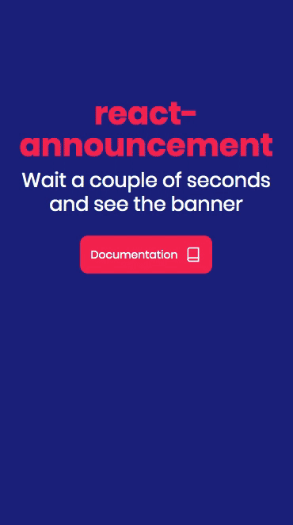

<p align="center">
  
</p>

<div align="center">
  📣 Push out beautiful website announcements in React 📣
</div>
<div align="center">
  This simple and modern component makes it easier for you to engage with your visitors in a non-intrusive way.
  The component is fully responsive and will render perfectly on desktop, tablets and mobile.
</div>

<br />

<div align="center">
  <!-- NPM version -->
  <a href="https://www.npmjs.com/package/react-announcement">
    
  </a>
  <!-- Downloads -->
  <a href="https://www.npmjs.com/package/react-announcement">
    
  </a>
  <!-- Standard -->
  <a href="https://standardjs.com">
    
  </a>
</div>

<div align="center">
  <h3>
    <a href="https://kristofferandreasen.github.io/react-announcement/">
      Example Website
    </a>
    <span> | </span>
    <a href="https://www.npmjs.com/package/react-announcement">
      npm module
    </a>
    <span> | </span>
    <a href="https://github.com/kristofferandreasen/react-announcement#properties">
      Properties
    </a>
    <span> | </span>
    <a href="https://github.com/kristofferandreasen/react-announcement#contributing">
      Contributing
    </a>
  </h3>
</div>

<div align="center">
  <sub>A small component to help you convert. Built with ❤︎ by
  <a href="https://github.com/kristofferandreasen">Kristoffer Andreasen</a>
</div>

<br />

<p align="center">
  
</p>

## Install

```bash
npm install --save react-announcement
```

## Usage

```tsx
import * as React from 'react'
import Logo from './logo.svg'
import Announcement from 'react-announcement'

class Example extends React.Component {
  render () {
    return (
      <Announcement
          title="Here is your component"
          subtitle="The best announcement component for React is finally here. Install it in all your projects."
          link="https://github.com/kristofferandreasen/react-announcement"
          imageSource={Logo}
      />
    )
  }
}
```

### Usage with optional properties

This example includes the optional properties in the component.

The `daysToLive` property changes to cookie created by the component.
This way you can control how many days you want to wait before you show the announcement to the same user.

The `secondsBeforeBannerShows` property changes the amount of seconds a user wait before the announcement is presented.

The `closeIconSize` is to allow you to change to size of the icon in the top right corner.

The `animateInDuration` changes the duration of the fade-in animation.

The `animateOutDuration` changes the duration of the fade-out animation - this is fired on click of the close icon.

```tsx
import * as React from 'react'
import Logo from './logo.svg'
import Announcement from 'react-announcement'

class Example extends React.Component {
  render () {
    return (
      <Announcement
        title="Here is your component"
        subtitle="The best announcement component for React is finally here. Install it in all your projects."
        link="https://github.com/kristofferandreasen/react-announcement"
        imageSource={Logo}
        daysToLive={3}
        secondsBeforeBannerShows={20}
        closeIconSize={30}
        animateInDuration={2000}
        animateOutDuration={500}
      />
    )
  }
}
```

## Properties

Property | Type | Required | Default value | Description
:--- | :--- | :--- | :--- | :---
`title`|string|yes|| The title of the announcement
`subtitle`|string|yes|| The general card text on the announcement
`imageSource`|string|yes|| The image source string used on the left side of the image. Use a square image for the best results. Dimensions are 68x68 pixels.
`link`|string|yes|| The link used when the announcement is clicked.
`daysToLive`|number|no|7| An optional property specifying the number of days the cookie will live before the announcement is shown again to a user.
`secondsBeforeBannerShows`|number|no|5| The number of seconds a user has to keep the page open before the announcement is shown.
`animateInDuration`|number|no|1000| Changes the duration of the fade-in animation.
`animateOutDuration`|number|no|30| Change the duration of the fade-out animation.
-----

## Responsive

The announcement is shown in the left side of the screen on desktop and centered at the bottom on mobile.

<p align="center">
  
</p>

## Developing

The project is bootstrapped with [create-react-library](https://github.com/transitive-bullshit/create-react-library) and TypeScript has been added to the project. You can read more about the development workflow in the [project docs](https://github.com/transitive-bullshit/create-react-library).

To start developing, you need to open two terminals.

In the first tab, run from the main directory:
```
npm start
```
This will activate rollup to watch for any changes to your src directory and build the dist everytime.

In another terminal, navigate to the example folder:
```
cd example
```
Then run:
```
npm install
```
and finally:
```
npm start
```

This will start up the development server allowing you to see the results.
Be aware that the solution is setting a cookie and this cookie will be stored in your browser.
In order to see the banner again, you will need to open the localhost link in incognito or clear your browser cookies.

## Contributing

Your contributions are always welcome!
Please have a look at the [contribution guidelines](https://github.com/kristofferandreasen/react-announcement/blob/master/CONTRIBUTING.md) first 🎉

## License

MIT © [kristofferandreasen](https://github.com/kristofferandreasen)
